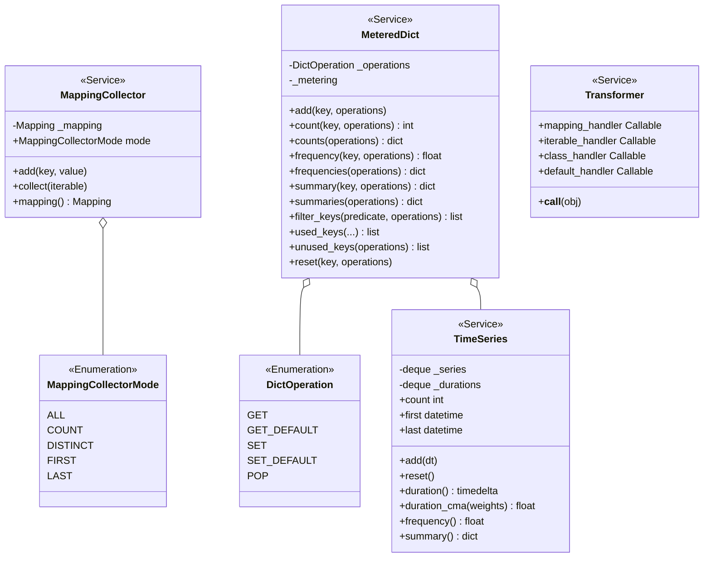

```mermaid
classDiagram
    class MappingCollector {
        <<Service>>
        -Mapping _mapping
        +MappingCollectorMode mode
        +add(key, value)
        +collect(iterable)
        +mapping() Mapping
    }

    class MappingCollectorMode {
        <<Enumeration>>
        ALL
        COUNT
        DISTINCT
        FIRST
        LAST
    }

    class MeteredDict {
        <<Service>>
        -DictOperation _operations
        -_metering
        +add(key, operations)
        +count(key, operations) int
        +counts(operations) dict
        +frequency(key, operations) float
        +frequencies(operations) dict
        +summary(key, operations) dict
        +summaries(operations) dict
        +filter_keys(predicate, operations) list
        +used_keys(...) list
        +unused_keys(operations) list
        +reset(key, operations)
    }

    class DictOperation {
        <<Enumeration>>
        GET
        GET_DEFAULT
        SET
        SET_DEFAULT
        POP
    }

    class TimeSeries {
        <<Service>>
        -deque _series
        -deque _durations
        +count int
        +first datetime
        +last datetime
        +add(dt)
        +reset()
        +duration() timedelta
        +duration_cma(weights) float
        +frequency() float
        +summary() dict
    }

    class Transformer {
        <<Service>>
        +mapping_handler Callable
        +iterable_handler Callable
        +class_handler Callable
        +default_handler Callable
        +__call__(obj)
    }

    MappingCollector o-- MappingCollectorMode
    MeteredDict o-- DictOperation
    MeteredDict o-- TimeSeries
```
