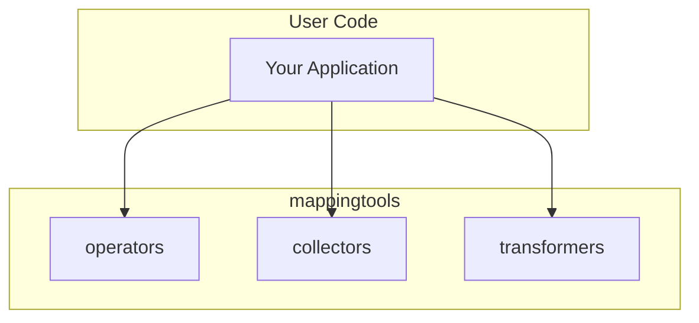

```mermaid
graph TD
    subgraph mappingtools
        direction LR
        A[operators]
        B[collectors]
        C[transformers]
    end

    subgraph "User Code"
        direction TB
        U[Your Application]
    end

    U --> A
    U --> B
    U --> C
```
