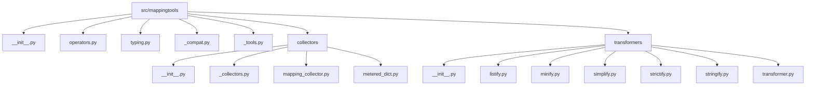

```mermaid
graph TD
    A[src/mappingtools] --> B[__init__.py]
    A --> C[operators.py]
    A --> D[typing.py]
    A --> E[_compat.py]
    A --> F[_tools.py]
    A --> G[collectors]
    A --> H[transformers]

    G --> G1[__init__.py]
    G --> G2[_collectors.py]
    G --> G3[mapping_collector.py]
    G --> G4[metered_dict.py]

    H --> H1[__init__.py]
    H --> H2[listify.py]
    H --> H3[minify.py]
    H --> H4[simplify.py]
    H --> H5[strictify.py]
    H --> H6[stringify.py]
    H --> H7[transformer.py]
```
