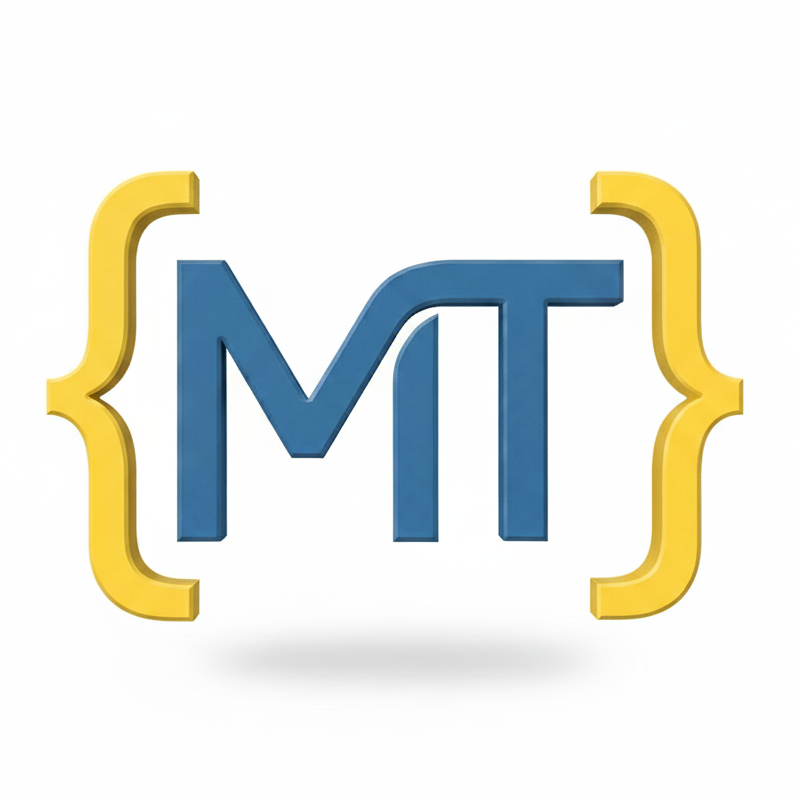

# Introduction

{ width="256" align=right loading=lazy }

## What is MappingTools?

This library provides utility functions for creating, manipulating, and transforming data structures, which have or
include Mapping-like characteristics.

Includes inverting dictionaries, converting class-like objects to dictionaries, creating nested defaultdicts, and
unwrapping complex objects.

## Why use MappingTools?

Built for developers who need more than just standard dictionaries.

| Problem                       | Solution                                                                                             |
|:------------------------------|:-----------------------------------------------------------------------------------------------------|
| **Broadcast Method Calls**    | Use `Dictifier` to call a method on every object in a dictionary at once, e.g., `users.notify("Hello!")`. |
| **Deep JSON Diffing**         | Use `flatten()` to collapse nested JSON into single-layer paths for easy comparison.                 |
| **Data Collisions**           | Use `inverse()` to swap keys/values without losing data (automatically creates sets for duplicates). |
| **Slow Config Loading**       | Use `MeteredDict` to profile exactly how many times your app reads specific config keys.             |
| **Quick Serialization**       | Use `simplify()` to instantly convert Dataclasses, and custom objects into pure Dicts.               |
