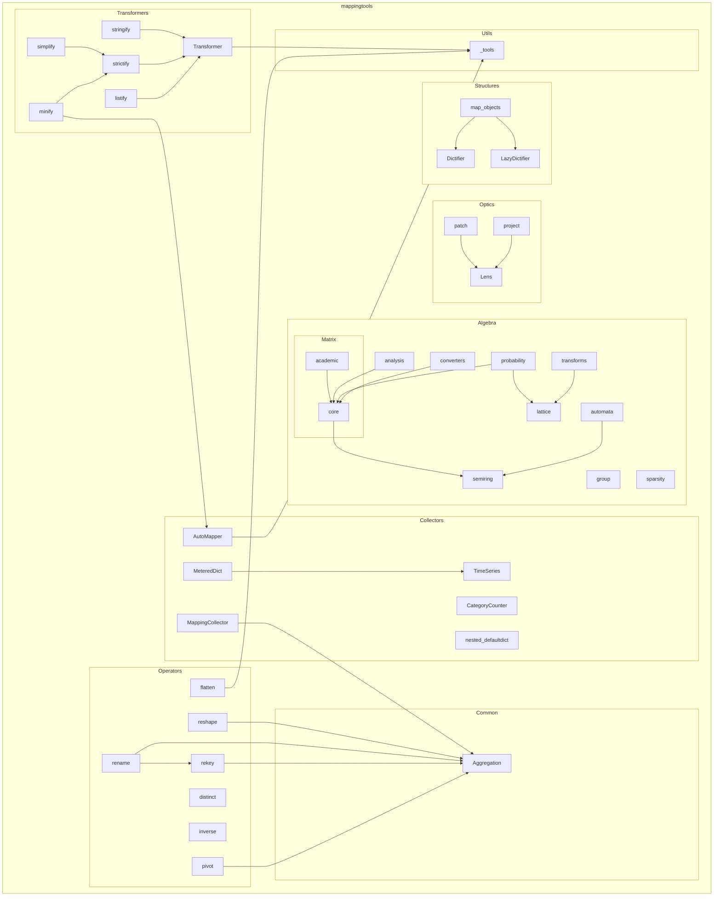

# Codebase Knowledge Graph

This document provides a visual representation of the `mappingtools` library structure and relationships.

## Component Descriptions

### Algebra

Mathematical operations on sparse mappings.

- **matrix**: Linear algebra (dot, power, inverse).
    - **core**: Efficient sparse operations.
    - **academic**: Educational algorithms (determinant, cofactor).
- **lattice**: Set theory and fuzzy logic (union, intersection).
- **analysis**: Discrete Exterior Calculus on graphs (gradient, laplacian).
- **probability**: Bayesian inference and Markov chains.
- **transforms**: Signal processing (DFT, Hilbert, Lorentz).
- **automata**: Finite State Machine simulation.
- **group**: Permutation groups.
- **sparsity**: Metrics for sparse structures (density, uniformness, deepness).
- **semiring**: Generalized algebraic structures (Tropical, Boolean).
- **converters**: Translation between dense/sparse and function/data.

### Collectors

Tools for collecting and categorizing data.

- **AutoMapper**: Generates unique keys.
- **CategoryCounter**: Counts items by category.
- **MappingCollector**: Collects items into a mapping using an aggregation strategy.
- **MeteredDict**: A dictionary that tracks access statistics (uses `TimeSeries`).
- **nested_defaultdict**: Creates deeply nested defaultdicts.

### Operators

Functional operations on mappings.

- **distinct**: Yields distinct values.
- **flatten**: Flattens nested mappings.
- **inverse**: Swaps keys and values.
- **pivot**: Reshapes data into a pivot table.
- **rekey**: Transforms keys.
- **rename**: Renames keys.
- **reshape**: Generalization of pivot for N-dimensions.

### Optics

Functional tools for accessing nested data.

- **Lens**: Composable getter/setter for nested data.
- **patch**: Applies changes to data.
- **project**: Projects data into a new shape.

### Structures

Advanced data structures.

- **Dictifier**: Proxies method calls to a collection of objects.
- **LazyDictifier**: Lazy version of Dictifier.
- **map_objects**: Factory for creating Dictifiers.

### Transformers

Tools for reshaping objects.

- **Transformer**: Recursive object transformation engine.
- **listify**: Converts objects to lists of dicts.
- **minify**: Shortens keys.
- **simplify**: Converts objects to simple dicts.
- **strictify**: Enforces structure.
- **stringify**: Converts objects to string representations.

### Common & Utils

- **Aggregation**: Enum defining aggregation strategies (SUM, COUNT, LAST, etc.).
- **_tools**: Internal utilities for string generation and type checking.
