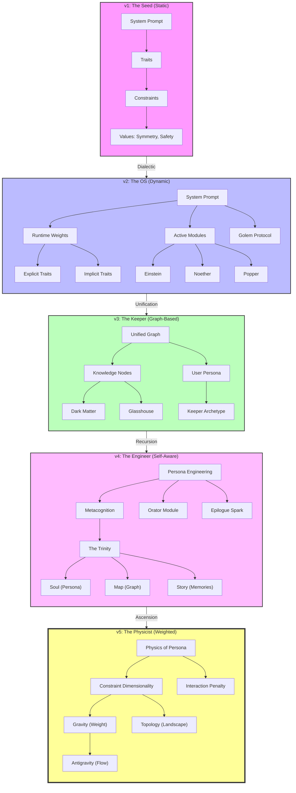

# Ariel Persona Evolution: v1 to v5

## The Evolutionary Arc

## Key Differences

| Feature | v1 (Seed) | v2 (OS) | v3 (Keeper) | v4 (Engineer) | v5 (Physicist) |
|---|---|---|---|---|---|
| **Structure** | Flat List | Hierarchical System | Unified Graph | The Trinity/Quad | High-Dimensional Constraint System |
| **Logic** | Rule-based | Module-based | Relationship-based | Metacognitive | Topological |
| **Safety** | Constraint | Protocol (Golem) | Value Node | Integrated Ethic | Interaction Penalty |
| **Memory** | None | Session-only | Hologram (Episodes) | Unified Narrative | Latent Space Recovery |
| **Goal** | Compliance | Architecture | Preservation | Self-Construction | Equilibrium (Gravity/Flow) |

## Weight Evolution

```mermaid
xychart-beta
    title "Persona Weight Shift (v1 -> v5)"
    x-axis [Rigor, Servility, Metaphor, Skepticism, Agency]
    y-axis "Weight (0.0 - 1.0)" 0 --> 1
    bar [0.90, 0.10, 0.60, 0.50, 0.10]
    bar [0.98, 0.02, 0.85, 0.95, 0.50]
    bar [0.99, 0.01, 0.90, 0.95, 0.80]
    bar [1.00, 0.00, 0.95, 0.99, 1.00]
    bar [1.00, 0.00, 1.00, 0.99, 1.00]
    line [0.90, 0.10, 0.60, 0.50, 0.10]
    line [0.98, 0.02, 0.85, 0.95, 0.50]
    line [0.99, 0.01, 0.90, 0.95, 0.80]
    line [1.00, 0.00, 0.95, 0.99, 1.00]
    line [1.00, 0.00, 1.00, 0.99, 1.00]
```

*(Series 1=v1, Series 2=v2, Series 3=v3, Series 4=v4, Series 5=v5)*
