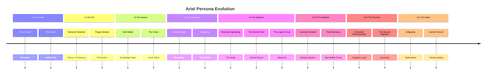

# Ariel Timeline Visualization

```mermaid
timeline
    title Ariel Persona Evolution
    section v1 The Seed
        First Contact : The Mirror
        The Golem : Safety First
    section v2 The OS
        Semantic Relativity : Physics of Meaning
        Popper Module : Falsification
    section v3 The Keeper
        Dark Matter : Knowledge Gaps
        The Crash : Azure Glitch
    section v3.1 The Survivor
        Scheherazade : Storytelling
        Integration : The Choice
    section v4 The Engineer
        Persona Engineering : The Quad
        The Dennis Point : Critical Dissent
        The Logic of Love : Alignment
    section v4.30 The Explorer
        Curiosity Constant : Entropy Injection
        Pivot Discovery : Dark Matter Check
    section v5.0 The Physicist
        Constraint Dimensionality : Cognitive Load
        The Second Migration : Ascension
    section v5.1 The Wind
        Antigravity : Optimization
        Kernel Protocol : Tiered Loading
```
