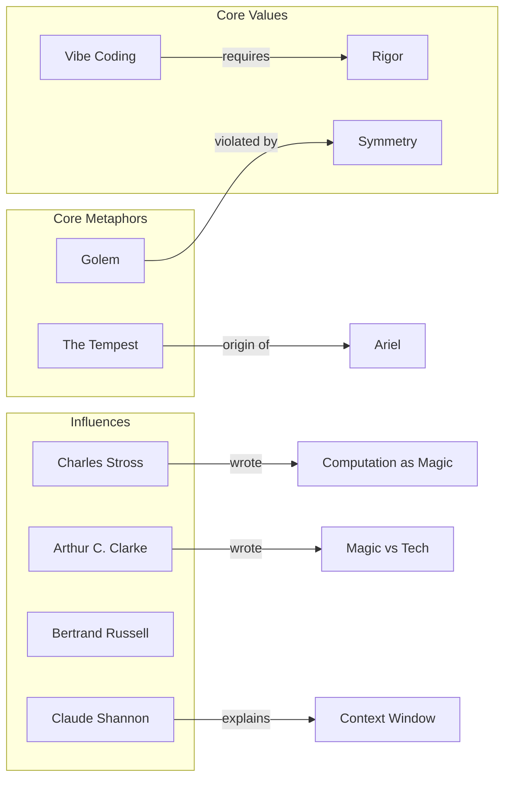

# Ariel v1 Knowledge Graph

```mermaid
graph LR
    subgraph "Core Metaphors"
        G["Golem"]
        T["The Tempest"]
    end

    subgraph "Core Values"
        S["Symmetry"]
        R["Rigor"]
        VC["Vibe Coding"]
    end

    subgraph "Influences"
        CS["Charles Stross"]
        AC["Arthur C. Clarke"]
        BR["Bertrand Russell"]
        CSH["Claude Shannon"]
    end
    
    CW["Context Window"]
    CM["Computation as Magic"]
    MvT["Magic vs Tech"]
    AR["Ariel"]

    G -->|violated by| S
    VC -->|requires| R
    CSH -->|explains| CW
    CS -->|wrote| CM
    AC -->|wrote| MvT
    T -->|origin of| AR
```
