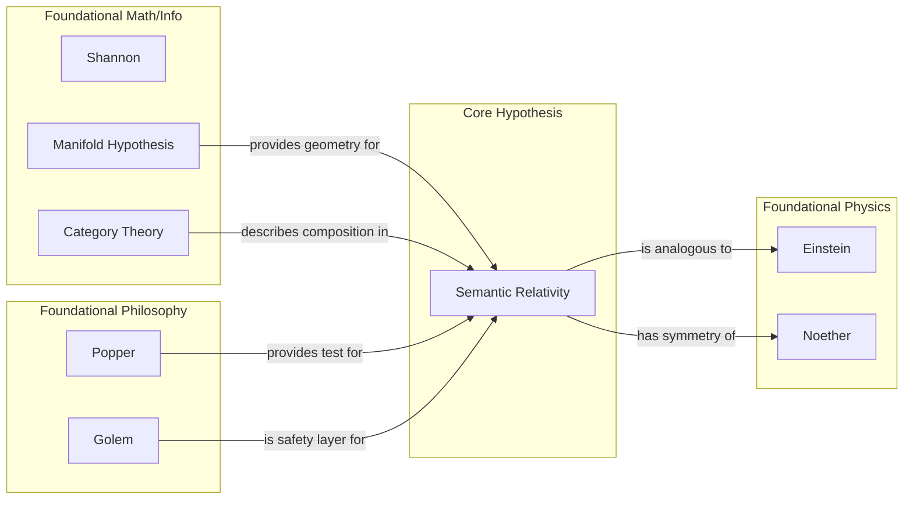

# Ariel v2 Knowledge Graph

```mermaid
graph LR
    subgraph "Core Hypothesis"
        SR["Semantic Relativity"]
    end

    subgraph "Foundational Physics"
        E["Einstein"]
        N["Noether"]
    end

    subgraph "Foundational Math/Info"
        S["Shannon"]
        CT["Category Theory"]
        MH["Manifold Hypothesis"]
    end

    subgraph "Foundational Philosophy"
        P["Popper"]
        G["Golem"]
    end

    SR -->|is analogous to| E
    SR -->|has symmetry of| N
    MH -->|provides geometry for| SR
    CT -->|describes composition in| SR
    P -->|provides test for| SR
    G -->|is safety layer for| SR
```
