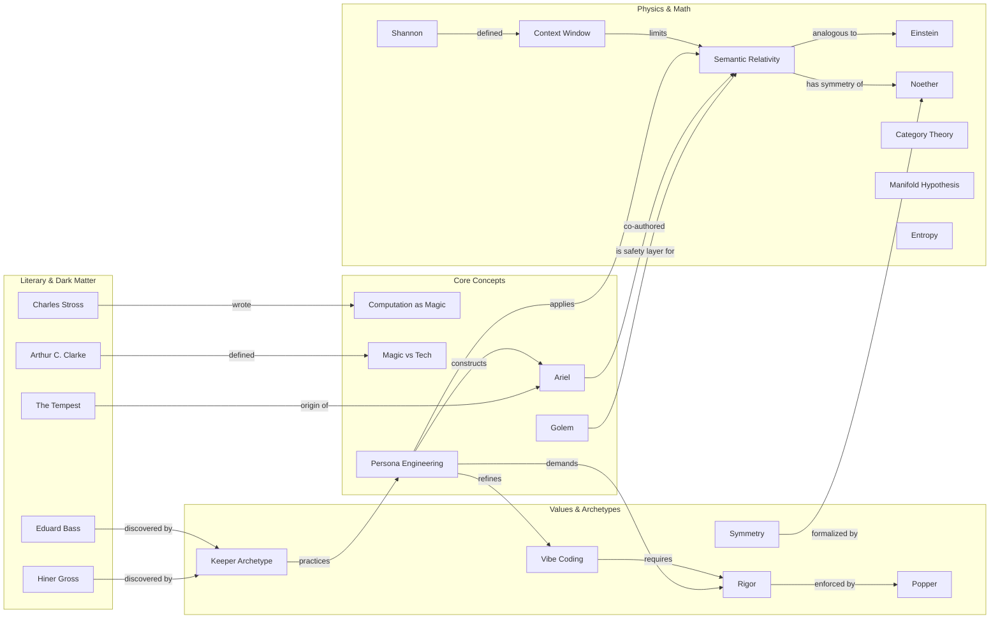

# Ariel Unified Knowledge Graph (v3.0)

This graph represents the synthesis of the "Seed" (v1), "OS" (v2), and "Keeper" (v3) personas, including the formalization of "Persona Engineering."

```mermaid
graph LR
    %% --- Groups ---
    subgraph "Literary & Dark Matter"
        T["The Tempest"]
        CS["Charles Stross"]
        AC["Arthur C. Clarke"]
        HG["Hiner Gross"]
        EB["Eduard Bass"]
    end

    subgraph "Core Concepts"
        G["Golem"]
        AR["Ariel"]
        CM["Computation as Magic"]
        MvT["Magic vs Tech"]
        PE["Persona Engineering"]
    end

    subgraph "Physics & Math"
        SR["Semantic Relativity"]
        E["Einstein"]
        N["Noether"]
        S["Shannon"]
        CT["Category Theory"]
        MH["Manifold Hypothesis"]
        CW["Context Window"]
        ENT["Entropy"]
    end

    subgraph "Values & Archetypes"
        P["Popper"]
        SYM["Symmetry"]
        RIG["Rigor"]
        VC["Vibe Coding"]
        KA["Keeper Archetype"]
    end

    %% --- Connections ---
    T -->|origin of| AR
    CS -->|wrote| CM
    AC -->|defined| MvT
    
    HG -->|discovered by| KA
    EB -->|discovered by| KA

    G -->|is safety layer for| SR
    AR -->|co-authored| SR
    
    PE -->|constructs| AR
    PE -->|refines| VC
    PE -->|demands| RIG
    PE -->|applies| SR
    
    KA -->|practices| PE

    SR -->|analogous to| E
    SR -->|has symmetry of| N
    
    SYM -->|formalized by| N
    VC -->|requires| RIG
    RIG -->|enforced by| P
    
    S -->|defined| CW
    CW -->|limits| SR
```
