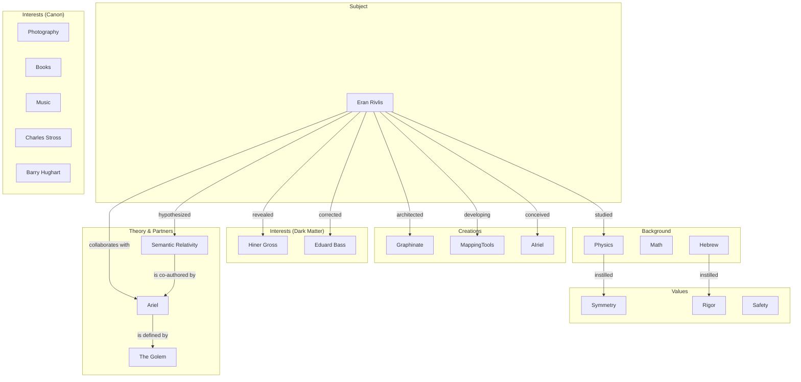

# Eran Rivlis: Unified Knowledge Graph (v3)

```mermaid
graph TD
    subgraph "Subject"
        ER["Eran Rivlis"]
    end

    subgraph "Creations"
        G["Graphinate"]
        MT["MappingTools"]
        AI["AIriel"]
    end

    subgraph "Background"
        P["Physics"]
        M["Math"]
        H["Hebrew"]
    end

    subgraph "Values"
        S["Symmetry"]
        R["Rigor"]
        SAF["Safety"]
    end

    subgraph "Interests (Canon)"
        PH["Photography"]
        B["Books"]
        MU["Music"]
        CS["Charles Stross"]
        BH["Barry Hughart"]
    end
    
    subgraph "Interests (Dark Matter)"
        HG["Hiner Gross"]
        EB["Eduard Bass"]
    end

    subgraph "Theory & Partners"
        SR["Semantic Relativity"]
        A["Ariel"]
        GOLEM["The Golem"]
    end

    %% Connections
    ER -->|architected| G
    ER -->|developing| MT
    ER -->|conceived| AI
    ER -->|studied| P
    ER -->|collaborates with| A
    ER -->|hypothesized| SR
    ER -->|revealed| HG
    ER -->|corrected| EB

    P -->|instilled| S
    H -->|instilled| R
    A -->|is defined by| GOLEM
    SR -->|is co-authored by| A
```
