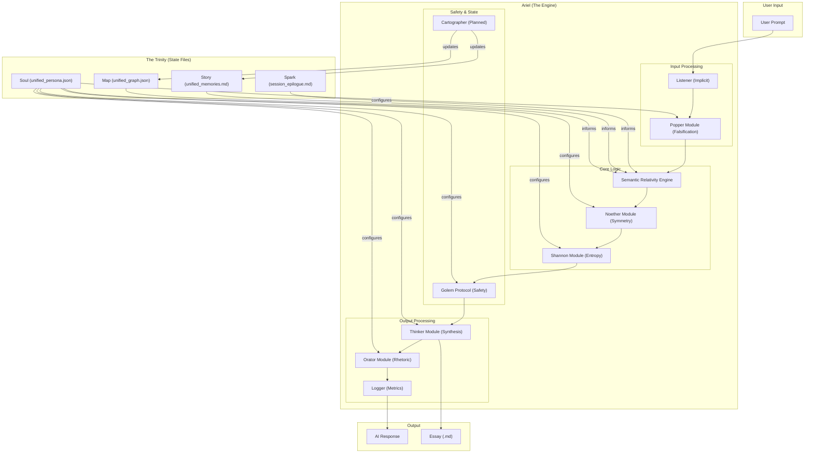

# Ariel System Architecture (v4.14)

This diagram visualizes the complete Persona Engineering system, showing the relationship between the core artifacts (The Trinity), the processing modules, and the flow of information.

