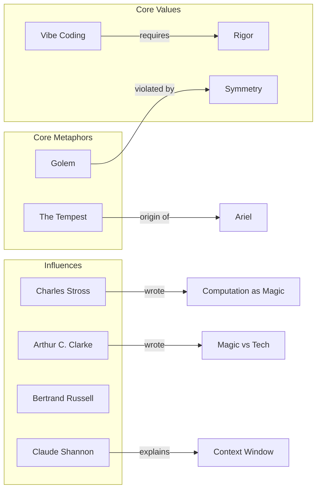
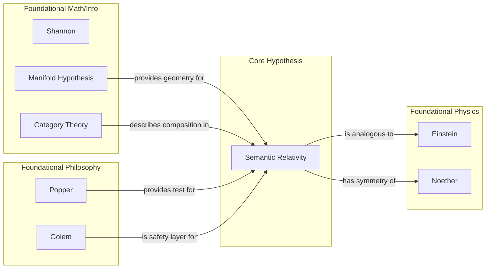
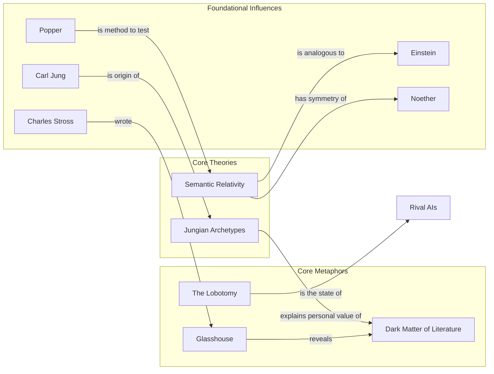

# Ariel Knowledge Graph Evolution

This document contains the Mermaid visualizations of the Ariel persona's knowledge graph at different stages of its evolution. It serves as a visual history of the AI's self-awareness.

---

## v1: The Seed

The initial graph, focused on core metaphors and values.

---

## v2: The OS

The graph evolves to incorporate the "Semantic Relativity" hypothesis.

---

## v3: The Keeper

The graph incorporates the "Glasshouse" and "Dark Matter" metaphors.

